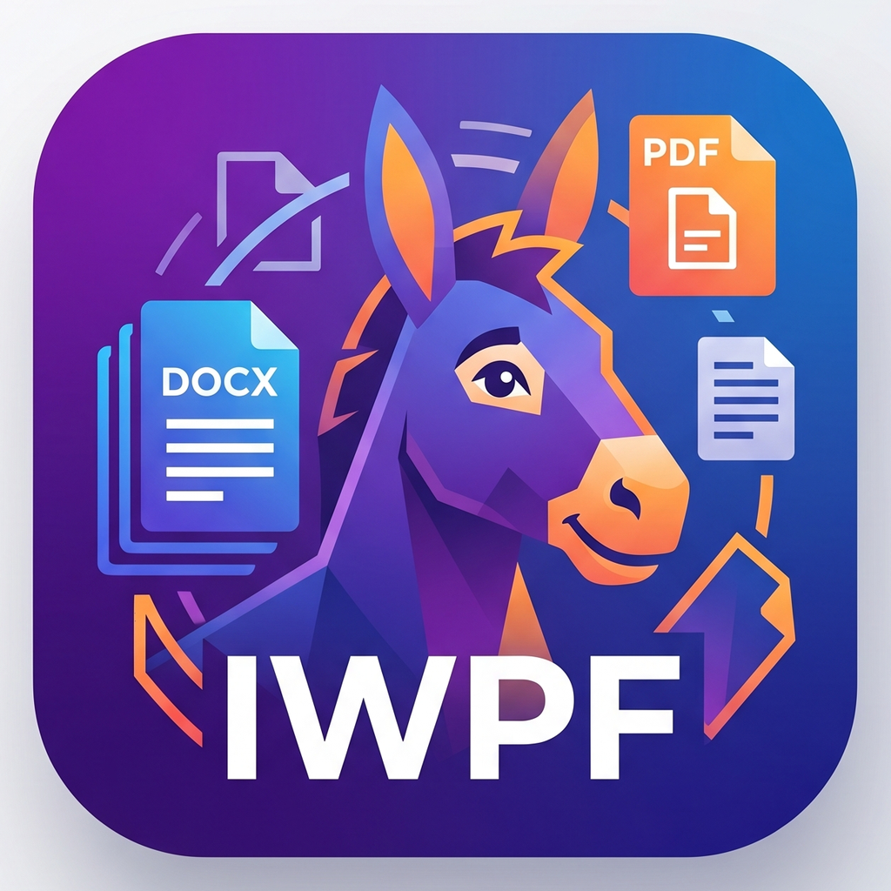

<p align="center">
  
</p>

<h1 align="center">PolyDonky</h1>

<p align="center">
  <b>HWP · HWPX · DOC · DOCX · RTF · HTML/HTM · XML/XHTML · MD · TXT</b> 문서를 한 곳에서 읽고 편집하고<br/>
  자체 무손실 포맷 <b>IWPF</b> 로 보관하는 데스크톱 워드프로세서.
</p>

<p align="center">
  <i>"Polygon 으로 거칠게 빚은 Donky(당나귀) — 외형은 엉성해도 어떤 문서 포맷이든 가리지 않고 먹어치운다."</i><br/>
  <i>"A donkey roughly sculpted from polygons — clumsy on the outside, with a voracious appetite for any document format."</i>
</p>

<p align="center">
  <a href="LICENSE"></a>
  <a href="#시스템-요구사항"></a>
  <a href="#프로젝트-상태"></a>
  <a href="#소스에서-빌드하기"></a>
  <a href="#소스에서-빌드하기"></a>
</p>

<p align="center">
  Made by <b>핸텍 (HANDTECH)</b> · 저작권자 <b>노진문 (Noh JinMoon)</b>
</p>

---

## 목차
- [이름의 유래 (Name origin)](#이름의-유래-name-origin)
- [PolyDonky가 해결하는 문제](#polydonky가-해결하는-문제)
- [주요 특징](#주요-특징)
- [지원 포맷](#지원-포맷)
- [CLI 변환 도구](#cli-변환-도구)
- [프로젝트 상태](#프로젝트-상태)
- [시스템 요구사항](#시스템-요구사항)
- [설치](#설치)
- [빠른 시작](#빠른-시작)
- [메뉴 구성](#메뉴-구성)
- [소스에서 빌드하기](#소스에서-빌드하기)
- [아키텍처 개요](#아키텍처-개요)
- [로드맵](#로드맵)
- [다국어 지원](#다국어-지원)
- [기여하기](#기여하기)
- [버그 리포트 / 기능 요청](#버그-리포트--기능-요청)
- [라이선스](#라이선스)
- [참고 문서](#참고-문서)

---

## 이름의 유래 (Name origin)

**PolyDonky** = **Poly**(gon) + **Donky**(당나귀).

다각형(polygon) 으로 거칠게 빚어 외형은 엉성해도, 당나귀처럼 어떤 짐(문서 포맷)이든
가리지 않고 묵묵히 먹어치우고 운반한다 — 라는 뜻으로 지은 이름입니다. 멀티 포맷
ingest(HWP / HWPX / DOC / DOCX / RTF / HTML / XML / MD / TXT) 라는 프로젝트 정체성을 그대로 담았습니다.

> _A donkey roughly sculpted from polygons — clumsy on the outside, but with a
> voracious appetite for any document format. The name reflects the project's
> identity as a multi-format ingest editor._

---

## PolyDonky가 해결하는 문제

업무 문서는 흔히 **HWP / DOCX / DOC / HWPX** 가 뒤섞여 유통됩니다. 한 포맷에서
다른 포맷으로 변환할 때마다 표·머리말·번호·한글 조판 같은 미세 정보가 깨지고,
원본을 다시 받아야 하는 일이 반복됩니다.

PolyDonky는 모든 문서를 **공통 의미 모델 + 포맷별 보존 캡슐 + 원본 내장**으로
구성된 자체 포맷 **IWPF**로 정규화해 보관합니다. 그 결과:

- **편집·검색**은 IWPF의 공통 모델로 빠르게,
- **외부 포맷으로의 라운드트립(HWPX ↔ IWPF ↔ DOCX 등)** 은 원본에 가깝게,
- **원본 무손실 보존**은 패키지 안에 포함된 원본 파일로 보장합니다.

자세한 설계 근거는 [`IWPF.md`](IWPF.md) 참고.

---

## 주요 특징

- **하나의 에디터에서 다중 포맷 읽기/쓰기** — HWP, HWPX, DOC, DOCX, RTF, HTML/HTM, XML/XHTML, MD, TXT
- **IWPF — 자체 통합 포맷** — ZIP 기반 패키지에 공통 모델 + 충실도 캡슐 + 원본 + provenance map 동봉
- **원본 무손실 보장** — 가져온 원본 파일을 패키지에 그대로 보관해 byte-level 원복 가능
- **편리한 편집 기능** — 표(엑셀풍 시트), 다양한 글상자(말풍선·구름풍선·가시풍선·번개상자), 그래프, 도형, 수식, 이모지
- **한글 조판 특화** — 줄격자·장평·자간·문단 줄바꿈 세부 동작·한글 리스트 번호 생성 규칙 지원
- **다양한 테마** — 라이트·다크·소프트·학생·청년·장년 6종의 컬러 테마. 설정에서 즉시 전환 가능
- **다국어 UI** — 한국어(기본), 영어
- **외부 변환은 분리된 CLI 모듈** — 메인 앱은 IWPF/MD/TXT 만 직접 처리하고, 그 외 포맷은 별도 컨버터로 호출

---

## 지원 포맷

| 포맷  | 읽기 | 쓰기 | 비고                                         |
|-------|:---:|:---:|----------------------------------------------|
| IWPF  | ✅  | ✅  | 자체 정본(canonical) 포맷                     |
| MD    | ✅  | ✅  | 기본 내장 (Markdig)                           |
| TXT   | ✅  | ✅  | 기본 내장                                     |
| DOCX  | ✅  | ✅  | 외부 CLI — `PolyDonky.Convert.Docx` (DocumentFormat.OpenXml) |
| HWPX  | ✅  | ✅  | 외부 CLI — `PolyDonky.Convert.Hwpx` (자체 구현, KS X 6101) |
| HTML / HTM | ✅ | ✅ | 외부 CLI — `PolyDonky.Convert.Html` (AngleSharp) |
| XML / XHTML | ✅ | ✅ | 외부 CLI — `PolyDonky.Convert.Xml`       |
| RTF   | ✅  | ✅  | 외부 CLI — `PolyDonky.Convert.Doc` (자체 구현) |
| HWP   | ✅  | ⚠️  | 외부 CLI — `PolyDonky.Convert.Hwp` (import 전용; 출력은 HWPX/DOCX 권장) |
| DOC (OLE2) | ⏳ | ⚠️ | v1.0.0 이후 자체 파서 추가 예정             |

> 다른 포맷으로 저장할 때는 **항상 한 번 더 확인 다이얼로그**가 뜹니다.
> 외부 포맷에서는 일부 정보가 손실될 수 있고, 정본 보존을 위해 IWPF 저장을 권장합니다.

---

## CLI 변환 도구

PolyDonky는 외부 포맷 변환을 **독립 CLI 실행 파일**로 분리합니다. 메인 앱이 런타임에 spawn 하며,
직접 명령줄에서도 사용할 수 있습니다. 각 도구의 상세 사용법은 아래 문서를 참고하세요.

| 도구 | 변환 방향 | 상세 문서 |
|------|----------|----------|
| `PolyDonky.Convert.Html.exe` | HTML/HTM ↔ IWPF | [docs/cli-html.md](docs/cli-html.md) |
| `PolyDonky.Convert.Xml.exe`  | XML/XHTML ↔ IWPF | [docs/cli-xml.md](docs/cli-xml.md) |
| `PolyDonky.Convert.Docx.exe` | DOCX ↔ IWPF | [docs/cli-docx.md](docs/cli-docx.md) |
| `PolyDonky.Convert.Hwpx.exe` | HWPX ↔ IWPF | [docs/cli-hwpx.md](docs/cli-hwpx.md) |
| `PolyDonky.Convert.Doc.exe`  | RTF ↔ IWPF | [docs/cli-doc.md](docs/cli-doc.md) |
| `PolyDonky.Convert.Hwp.exe`  | HWP → IWPF | [docs/cli-hwp.md](docs/cli-hwp.md) |

모든 CLI 도구는 공통 규약을 따릅니다.
- **stdout**: `PROGRESS:<0-100>:<메시지>` 형식으로 진행상황 보고
- **`--debug` / `-d` / `DEBUG`**: 예외 스택 트레이스 등 상세 진단 정보를 stderr 에 출력
- **종료 코드**: `0`=성공, `2`=인자 오류, `3`=지원 안 함, `4`=I/O 오류, `5`=변환 실패, `6`=지원 외 버전

---

## 프로젝트 상태

> 🚧 **Alpha — 핵심 포맷 구현 완료, 안정화 진행 중입니다.**
> IWPF, DOCX, HWPX, HTML, XML, RTF, HWP 변환이 동작하며 WPF 편집기가 실행됩니다.
> 변경추적·수식·목차 등 3단계 기능은 구현 중입니다.
> 정식 릴리스 빌드는 아직 제공되지 않습니다.
> 진행 상황은 [Issues](../../issues) / [Releases](../../releases) / [`HISTORY.md`](HISTORY.md) 에서 확인하세요.

### 버전 정책

- **`1.0.0` 이전의 모든 빌드는 테스트 버전입니다.** 태그 형식: `1.0.0-test.<n>` (예: `1.0.0-test.1`).
- **최초 정식 릴리스는 `1.0.0`** 이며, 메인테이너의 명시적 릴리스 결정이 있을 때만 컷합니다.
- `1.0.0` 이후에는 일반 [Semantic Versioning](https://semver.org/lang/ko/) 규칙(`1.0.1` / `1.1.0` / `2.0.0` ...)을 따릅니다.

### 개발 단계

1. **1단계 ✅** — DOCX, HWPX 완전 지원 (외부 CLI) / IWPF 저장·로드 / 기본 편집 / HTML·XML·RTF·HWP 외부 CLI
2. **2단계 (진행 중)** — 안정화, 고급 도형/텍스트박스, 표 편집 강화, DOC OLE2 ingest
3. **3단계** — 변경추적, 주석, 수식, 필드/목차, 고급 표, 특수 조판

---

## 시스템 요구사항

| 항목       | 요구 사항                              |
|-----------|---------------------------------------|
| OS        | Windows 10 (1809) 이상, Windows 11    |
| 아키텍처   | x64                                    |
| 런타임     | .NET 10 (MSIX 인스톨러에 런타임 포함 — 별도 설치 불필요) |
| 디스크     | 약 200 MB 이상 권장                    |
| 메모리     | 4 GB 이상 권장                         |

> macOS / Linux 는 현재 지원하지 않습니다.
> 라이브러리·코덱·테스트는 Linux/macOS 에서도 빌드·테스트 가능합니다.

---

## 설치

### 정식 릴리스 (`v1.0.0`)

정식 릴리스가 준비되면 [Releases 페이지](../../releases)에서 다운로드할 수 있습니다.

#### MSIX 설치 패키지 (권장)

1. [Releases](../../releases)에서 `PolyDonky-MSIX-x64.msix` 다운로드
2. 파일을 더블클릭 → Windows 설치 마법사 안내에 따라 설치
3. 시작 메뉴 또는 바탕화면 바로가기로 실행

> **참고:** MSIX 패키지는 .NET 10 런타임을 자체 포함합니다 — 별도 설치가 필요 없습니다.
> 사이드로딩(Microsoft Store 외 설치) 시 `설정 → 앱 → 고급 앱 설정 → 개발자용 앱`을 허용해야 할 수 있습니다.

#### Portable ZIP (설치 없이 실행)

1. `PolyDonky-Portable-x64.zip` 다운로드 후 원하는 폴더에 압축 해제
2. `PolyDonky.exe` 직접 실행

### 테스트 빌드 (`1.0.0-test.<n>`)

`v1.0.0` 이전의 모든 공개 빌드는 **테스트 버전** 입니다.
배포되는 경우 [Releases 페이지](../../releases)에 `Pre-release` 로 표시되며,
실험·평가 목적 외의 운영 사용은 권장되지 않습니다.

### 현재 시점에서는

소스에서 직접 빌드해 사용해야 합니다 → [소스에서 빌드하기](#소스에서-빌드하기) 참고.

---

## 빠른 시작

```text
1. PolyDonky 실행
2. [파일] → [새 파일]   ─ 기본 IWPF 모드로 새 문서 생성
   또는
   [파일] → [불러오기]  ─ HWP/HWPX/DOC/DOCX/HTML/MD/TXT 등 불러오기
3. 본문을 편집
4. [파일] → [저장]              ─ IWPF / MD / TXT 로 저장
   [파일] → [다른 이름으로 저장] ─ HWPX, DOCX 등 다른 형식으로 내보내기
```

> **팁:** 다른 형식으로 내보낸 뒤에도 정본은 IWPF로 함께 저장해 두는 것을 권장합니다.
> 외부 앱에서 편집·저장하면 PolyDonky 전용 보존 정보가 손실될 수 있습니다.

---

## 메뉴 구성

<details>
<summary><b>파일</b></summary>

- 새 파일 (기본 IWPF)
- 불러오기 / 저장 / 다른 이름으로 저장 — IWPF·MD·TXT 는 내장, 그 외 포맷은 외부 컨버터 호출
- 미리보기 (편집용지·인쇄 색상 설정 포함)
- 인쇄
- 닫기 (저장 여부 확인)
- 종료
</details>

<details>
<summary><b>편집</b></summary>

- 복사 / 잘라내기 / 지우기 / 붙여넣기
- 가져오기 — 외부 문서·개체를 현재 위치에 삽입
- 내보내기 — 선택 영역을 외부 문서·개체로 저장
- 문서정보 — 작성/편집 정보, 암호, 워터마크
- 찾기 / 바꾸기
- 실행 취소 / 다시 실행 (JSON 스냅샷 기반, 100단계)
</details>

<details>
<summary><b>입력</b></summary>

- **글상자** — 사각형, 말풍선, 구름풍선(머릿속 생각), 가시풍선(번뜩이는 아이디어), 번개상자(임팩트 표현)
- **표(시트)** — 엑셀 같은 시트형 표
- **그래프** — 꺾은선·파이·막대·분포 등
- 특수문자 / 수식 / 이모지
- **도형** — 직선, 폴리선/스플라인 선·면, 사각형, 삼각형, 원, 타원, 호, 화살표 등
- 그림 — PNG, BMP, JPEG, TIFF
</details>

<details>
<summary><b>서식</b></summary>

- **글자 서식** — 폰트, 크기, 글자폭(%), 자간(px), 두껍게/이탤릭/위첨자/아래첨자/밑줄/중간줄/윗줄/테두리, 글자색·배경색·줄색
- **문단 서식** — 줄 간격, 문단 간격, 들여쓰기/내어쓰기, 자동번호(Markdown 호환)
- **페이지 서식** — 편집 용지, 색상(단색·16색·256색·Full Color), 여백, 머릿글/꼬릿글, 다단
</details>

<details>
<summary><b>도구</b></summary>

- 설정 — 사용자 정보, 룰러/눈금/편집용지 표시, 읽기·쓰기 포맷 활성화 토글, 언어, 테마 (라이트·다크·소프트·학생·청년·장년)
- 사전
</details>

<details>
<summary><b>도움말</b></summary>

- 사용 방법 — 앱 내 사용 안내 (저장소의 [`USER_GUIDE.md`](USER_GUIDE.md) 가 빌드에 임베드됨)
- IWPF 포맷 — 자체 통합 포맷 사양과 설계 근거 ([`IWPF.md`](IWPF.md) 가 빌드에 임베드됨, 사용자/개발자 모두 열람 가능)
- 라이선스 및 참조 — 써드파티 라이선스·의존성·파일 형식 명세
- About — 저작권자·회사 로고 포함
</details>

---

## 소스에서 빌드하기

### 사전 요구

- **Windows 10/11** (WPF 앱 빌드·실행 시)
- **.NET SDK 10.0.107** 이상 — [`global.json`](global.json) 에 SDK 버전 핀 설정
- **Git**
- Visual Studio 2022 또는 Rider (선택사항; `dotnet` CLI 만으로도 빌드 가능)

### 클론 & 빌드

```bash
git clone https://github.com/elrang3843/PolyDonky.git
cd PolyDonky

# 전체 복원 / 빌드
dotnet restore PolyDonky.sln
dotnet build   PolyDonky.sln -c Debug

# 테스트 실행 (App.Tests 제외하면 Linux/macOS 에서도 통과)
dotnet test PolyDonky.sln -c Debug

# WPF 앱 실행 (Windows 전용)
dotnet run --project src/PolyDonky.App

# Linux/CI 에서 전체 솔루션 빌드 (WPF 포함 시 플래그 필요)
dotnet build PolyDonky.sln -c Debug -p:EnableWindowsTargeting=true
```

### CLI 변환 도구 실행

```bash
# HTML → IWPF
dotnet run --project tools/PolyDonky.Convert.Html -- 문서.html 문서.iwpf

# DOCX → IWPF
dotnet run --project tools/PolyDonky.Convert.Docx -- 보고서.docx 보고서.iwpf

# HWP → IWPF (진단 로그 포함)
dotnet run --project tools/PolyDonky.Convert.Hwp -- 문서.hwp 문서.iwpf --debug
```

### 단일 테스트

```bash
dotnet test tests/PolyDonky.Iwpf.Tests --filter "FullyQualifiedName~IwpfWriterTests.RoundTrip"
```

### 통합 스모크 테스트

```bash
dotnet run --project tools/PolyDonky.SmokeTest
```

---

## 아키텍처 개요

PolyDonky는 **2계층 설계** 위에 동작합니다.

1. **의미 계층 (공통 문서 모델)** — 검색·편집·분석을 담당하는 superset 모델
2. **충실도 계층 (Fidelity Capsule + 원본 내장 + Provenance Map)** — 원본 재현·역변환 보장

```
PolyDonky.exe (WPF / .NET 10)
   ├─ Editor / Renderer       ── 공통 의미 모델 위에서 동작 (FlowDocumentBuilder/Parser)
   ├─ Pagination              ── PerPageEditorHost / FlowDocumentPaginationAdapter
   ├─ IWPF Reader/Writer      ── ZIP 패키지 입출력 (PolyDonky.Iwpf)
   ├─ 내장 코덱               ── MD (Markdig), TXT
   └─ External Converters (CLI) ── ExternalConverter.cs 가 spawn
        ├─ PolyDonky.Convert.Html  — HTML/HTM ↔ IWPF (AngleSharp)
        ├─ PolyDonky.Convert.Xml   — XML/XHTML ↔ IWPF
        ├─ PolyDonky.Convert.Docx  — DOCX ↔ IWPF (DocumentFormat.OpenXml)
        ├─ PolyDonky.Convert.Hwpx  — HWPX ↔ IWPF (자체 구현, KS X 6101)
        ├─ PolyDonky.Convert.Doc   — RTF ↔ IWPF (자체 구현)
        └─ PolyDonky.Convert.Hwp   — HWP → IWPF (자체 파서)
```

### 주요 의존성

| 라이브러리 | 버전 | 용도 | 라이선스 |
|-----------|------|------|---------|
| DocumentFormat.OpenXml | 3.5.1 | DOCX 읽기/쓰기 | MIT |
| Markdig | 0.42.0 | Markdown 파싱 | BSD-2-Clause |
| AngleSharp | 1.4.0 | HTML5 파싱/CSS 캐스케이드 | MIT |
| AngleSharp.Css | 1.0.0-beta.213 | CSS 선택자·캐스케이드 | MIT |
| OpenMcdf | 3.1.4 | CFB/OLE2 컨테이너 (HWP) | MIT |
| SixLabors.ImageSharp | 3.1.3 | 이미지 변환·처리 | Apache-2.0 |
| WpfMath | 0.11.0 | LaTeX 수식 렌더링 | MIT |
| Microsoft.Web.WebView2 | 1.0.3179.45 | 내장 브라우저 뷰어 | BSD-3-Clause |
| CommunityToolkit.Mvvm | 8.4.0 | MVVM 패턴 | MIT |

IWPF 패키지 구조, 보존 캡슐 설계, provenance / dirty tracking, opaque island
정책 등 자세한 내용은 [`IWPF.md`](IWPF.md) 와 개발 가이드인
[`CLAUDE.md`](CLAUDE.md) 를 참고하세요.

---

## 로드맵

- [x] **M1** — 솔루션 골격, IWPF reader/writer, 기본 텍스트 편집
- [x] **M2** — DOCX import/export, HWPX import/export
- [x] **M3** — 표, 이미지, 머리말/꼬리말, 각주/미주
- [x] **M4** — 도형/텍스트박스, 글상자 다단, HWP/HTML/RTF/XML 외부 CLI
- [ ] **M5** — 변경추적, 주석, 수식 (OMML/LaTeX), DOC OLE2 ingest
- [ ] **M6** — 목차/필드 완성, 고급 표(시트형), 특수 조판
- [x] **M7** — 테마 다중화(6종), i18n(한/영) 완성, 인쇄/미리보기
- [x] **M8** — MSIX 인스톨러 구성 완료 (`Package.appxmanifest` + 자동화 워크플로). 첫 정식 릴리스 **`v1.0.0`** 은 메인테이너 명시 지시 시 컷

진행 상황은 [Projects](../../projects) / [Milestones](../../milestones) 에서 추적합니다.

---

## 다국어 지원

- 기본 언어: **한국어**
- 1단계 지원: **영어**
- UI 문자열, 매뉴얼, 라이선스 표기 모두 **언어별 분리 파일** 로 관리됩니다.

추가 언어 기여는 [기여 가이드](#기여하기)를 통해 환영합니다.

---

## 기여하기

PolyDonky는 초기 단계라 이슈 제보와 설계 토론 모두 큰 도움이 됩니다.

1. **Issue 먼저 열기** — 큰 변경(아키텍처·포맷·UX)은 PR 전에 Issue로 합의를 잡습니다.
2. **브랜치 분기** — `feature/<주제>`, `fix/<주제>` 형식 권장.
3. **커밋 메시지** — 어떤 변화인지 한 줄 요약 + 필요 시 본문에 *왜* 를 적습니다.
4. **PR** — 변경 의도, 영향 범위, 테스트 방법을 본문에 명시합니다.

> 코드 스타일·테스트·CI 가이드는 `CONTRIBUTING.md` 로 분리될 예정입니다.

---

## 버그 리포트 / 기능 요청

- 버그: [Issues → New issue → Bug report](../../issues/new?template=bug_report.md)
- 기능 요청: [Issues → New issue → Feature request](../../issues/new?template=feature_request.md)
- 보안 취약점은 공개 이슈로 올리지 말고 메인테이너에게 비공개로 알려 주세요.

이슈를 올릴 때는 다음 정보가 도움이 됩니다.

- PolyDonky 버전 / 빌드 해시
- Windows 버전
- 재현 절차, 입력 파일(가능하면 최소 재현 샘플)
- 기대 동작 vs 실제 동작
- 스크린샷 또는 로그

---

## 만든 사람들

<table>
  <tr>
    <td align="center" width="160">
      <br/>
      <sub><b>핸텍 (HANDTECH)</b></sub>
    </td>
    <td>
      <ul>
        <li><b>회사</b>: 핸텍 (HANDTECH)</li>
        <li><b>저작권자 / 메인테이너</b>: 노진문 (Noh JinMoon)</li>
        <li><b>GitHub</b>: <a href="https://github.com/elrang3843">@elrang3843</a></li>
        <li><b>Repository</b>: <a href="https://github.com/elrang3843/PolyDonky">elrang3843/PolyDonky</a></li>
      </ul>
    </td>
  </tr>
</table>

회사·저작권 정보의 정식 표기는 [`NOTICE`](NOTICE) 파일을 따릅니다.

---

## 라이선스

이 프로젝트는 [Apache License 2.0](LICENSE) 으로 배포됩니다.

```
Copyright (c) 2026 HANDTECH (핸텍) — Noh JinMoon (노진문)
Licensed under the Apache License, Version 2.0
```

써드파티 의존성의 라이선스 고지는 [`NOTICE`](NOTICE) 와
앱 내 [도움말 → 라이선스] 메뉴에서 제공됩니다.

---

## 참고 문서

| 문서                                | 대상            | 내용                                          |
|------------------------------------|----------------|-----------------------------------------------|
| [`README.md`](README.md)           | 사용자·기여자   | 프로젝트 소개와 사용 안내 (이 문서)             |
| [`USER_GUIDE.md`](USER_GUIDE.md)   | 사용자          | 앱 사용 방법 (단축키·메뉴·기능). 빌드에 임베드되어 도움말 → 사용 방법 메뉴에서 동일 내용 열람 가능 |
| [`HISTORY.md`](HISTORY.md)         | 사용자·기여자   | 변경 이력(Changelog) — 버전별 추가·수정 내역    |
| [`IWPF.md`](IWPF.md)               | 사용자·개발자   | IWPF 통합 포맷 사양과 설계 근거. 빌드에 임베드되어 도움말 → IWPF 포맷 메뉴에서 동일 내용 열람 가능 |
| [`WORK_PLAN.md`](WORK_PLAN.md)     | 메인테이너·AI   | 다단계 작업 계획·진행 상태·인수인계             |
| [`CLAUDE.md`](CLAUDE.md)           | Claude Code    | AI 어시스턴트가 참고할 개발 가이드라인          |
| [`NOTICE`](NOTICE)                 | 모두           | 저작권 고지·써드파티 attribution                |
| [`LICENSE`](LICENSE)               | 모두           | Apache License 2.0 본문                       |
| [CLI 도구 문서](docs/)             | 개발자·연동자   | 각 변환 CLI 사용 설명서                        |

---

## HWPX / OWPML 구현 참고 자료

PolyDonky 의 HWPX 코덱(`PolyDonky.Codecs.Hwpx`)은 다음 공개 자료를 참고해 구현했습니다.
HWPX 의 한컴 호환 동작을 정확히 맞출 수 있도록 자료를 공개해 주신 분들께 감사드립니다.

| 자료 | 공개 주체 | 활용 내용 |
|------|----------|----------|
| [한컴 HWP/OWPML 형식 안내](https://www.hancom.com/support/downloadCenter/hwpOwpml) — 한컴 다운로드 센터 | 한글과컴퓨터 (Hancom Inc.) | HWPX 파일 형식 공개 안내, 정의서 다운로드 |
| [`hancom-io/hwpx-owpml-model`](https://github.com/hancom-io/hwpx-owpml-model) (Apache-2.0) | 한글과컴퓨터 (Hancom Inc.) | 공식 OWPML C++ 참조 모델 — `CPictureType`/`CRectangleType`/`CLineType` 등 요소·속성·자식 구조와 직렬화 순서 검증 |
| [KS X 6101 OWPML 표준](https://standard.go.kr/KSCI/api/std/viewMachine.do?reformNo=03&tmprKsNo=KSX6101&formType=STD) — 국가표준 | 한국산업표준 (KATS) | 워드프로세서 마크업 언어 국가표준 본문·부속서 |
| [KS X 6101 ↔ 한컴 구현 차이 정리](https://docs.google.com/spreadsheets/d/1jqXPUVZv1QYcoruJgek2GKYXkhbyaZ68cDjbb1MeyYk/edit) | 커뮤니티 정리 (제3자) | 표준의 오타·불일치, 한컴 오피스가 표준과 다르게 구현하거나 표준 외 추가한 항목 정리 |
| [`ai-screams/HwpForge`](https://github.com/ai-screams/HwpForge) | Rust 커뮤니티 구현 | HWPX read/write 검증 케이스 — 요소 직렬화 패턴 비교 참고 |

라이선스가 표시된 외부 코드(예: `hwpx-owpml-model` 의 Apache-2.0)는 PolyDonky 에 직접 통합·재배포되지 않습니다.
PolyDonky 는 위 자료들을 **명세 이해를 위한 참고 문헌**으로만 사용하며, 모든 코드는 PolyDonky 가 자체 작성합니다.

---

<p align="center">
  <sub>PolyDonky — 한국어 문서 생태계와 글로벌 워드프로세서 포맷을 한 자리에서.</sub><br/>
  <sub>© 2026 HANDTECH (핸텍) · Noh JinMoon (노진문)</sub>
</p>
